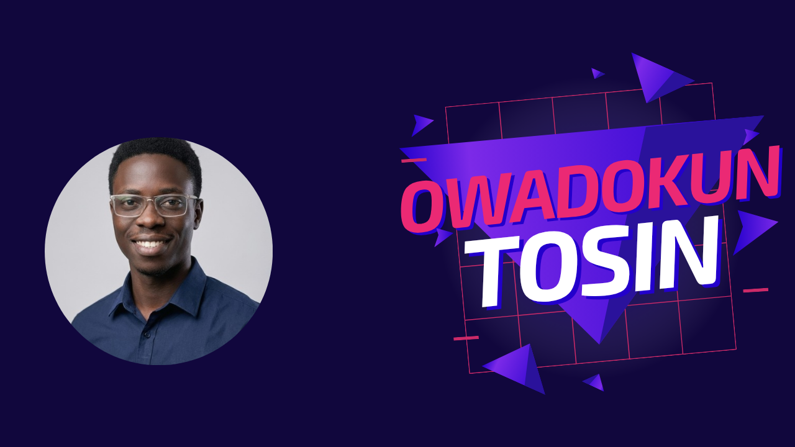
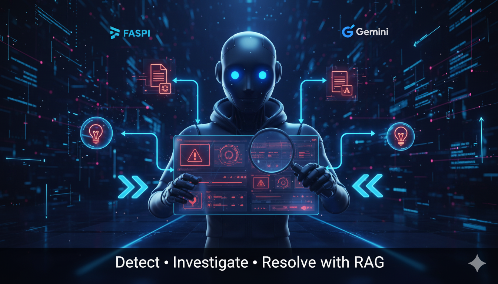
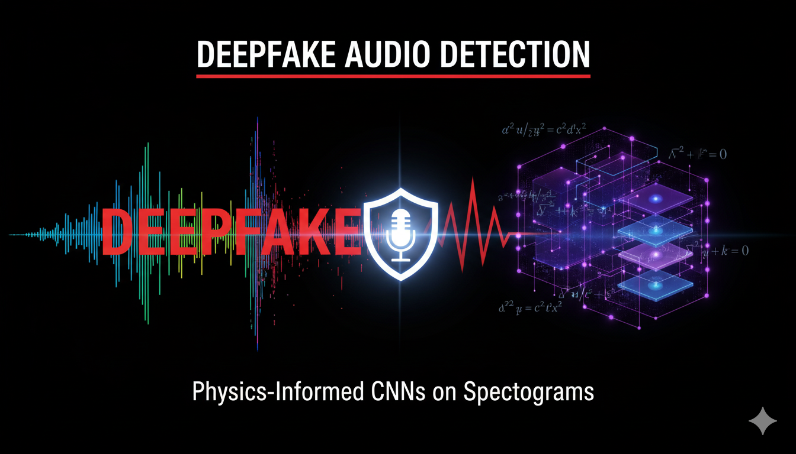
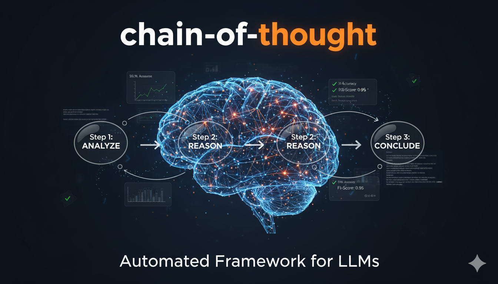

<!-- HERO SECTION -->

  

<!-- INTRO TEXT -->
<h2 align="center">
  Building the Immune System for Artificial Intelligence.
</h2>

  I bridge the gap between <b>Theoretical Physics</b> and <b>Production AI</b>. 
  Specializing in Adversarial Evaluation, MLOps, and Audio Forensics.

 

<!-- TECH STACK (Upscaled) -->
<!-- Using height="50" forces the icons to be much larger/readable -->

  

 

<!-- PROJECT GRID -->
<h2 align="center">🚀 Featured Engineering</h2>

<table border="0" width="100%">
  <tr>
    <!-- PROJECT 1: SENTINEL -->
    <td width="50%" align="center" valign="top">
      
        
      
       
      
<b>Self-Healing Infrastructure.</b> FastAPI Microservice using Physics (Z-Scores) to detect data drift.

    </td>
    <!-- PROJECT 2: SPECTRE -->
    <td width="50%" align="center" valign="top">
      
        
      
       
      
<b>Physics-Informed Forensics.</b> PyTorch CNN detecting AI audio via Spectral Analysis.

    </td>
  </tr>
  <tr>
    <!-- PROJECT 3: REASONBENCH -->
    <td width="50%" align="center" valign="top">
      
        
      
       
      
<b>Adversarial Evaluation.</b> Automated pipeline for auditing Chain-of-Thought logic.

    </td>
    <!-- PROJECT 4: POLYMIND -->
    <td width="50%" align="center" valign="top">
      
        
      
       
      
<b>AI-Gated Arbitrage.</b> XGBoost Strategy that predicts liquidity traps.

    </td>
  </tr>
</table>

 

<!-- NEW FOOTER: SYSTEM STATUS -->
<!-- Since we can't embed the app, we show the Live Status Badges of your apps -->
<h2 align="center">📡 Live Systems Status</h2>

<table align="center" border="0">
  <tr>
    <td align="center" style="padding: 20px;">
      
    </td>
    <td align="center" style="padding: 20px;">
      
    </td>
    <td align="center" style="padding: 20px;">
      
    </td>
  </tr>
</table>

 

<!-- CONTACT & STATS -->
<table align="center">
  <tr>
    <td>
      
    </td>
    <td>
      
    </td>
  </tr>
</table>

 

